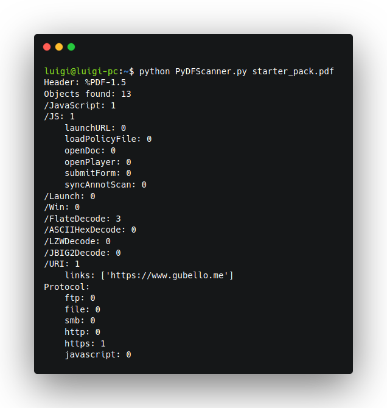

# 📡 PyDF Scanner

PyDF Scanner is a parsing tool to identify potential malicious elements in PDF documents.

---

Portable Document Format (PDF) is an old file format, developed by Adobe in 1993, but we still use it today. 
This file format has been often abused by malicious actors to exploit vulnerabilities or spread malware. 
PDF standard has remained about the same over years, but tools to process them are changed, grown. 
Initially, people read PDF documents using offline desktop tools (e.g. Adobe Acrobat Reader), 
but Internet has grown, and browsers and web services have become daily tools. 
Today you can open a PDF document in your browser (e.g. using PDFium in Chrome and PDF.js in Firefox), 
or you can edit or view a PDF document using a web service, based on PDF SDK (e.g. PSPDFKit, Foxit PDF SDK, PDFTron). 
In a similar context, PDF documents can be abused to exploit web vulnerabilities (e.g. XSS), 
by offering malicious actors an "evergreen" attack vector and a bigger attack surface. 

### Links

- [JavaScript™ for Acrobat® API Reference](http://wwwimages.adobe.com/content/dam/acom/en/devnet/acrobat/pdfs/js_api_reference.pdf) (2007)
- [Quickpost: About the Physical and Logical Structure of PDF Files](https://blog.didierstevens.com/2008/04/09/quickpost-about-the-physical-and-logical-structure-of-pdf-files/) by [Didier Stevens](https://twitter.com/DidierStevens) (2008)
- [How to really obfuscateyour PDF malware](https://static.googleusercontent.com/media/www.zynamics.com/it//downloads/recon_pdf.pdf) by [Sebastian Porst](https://twitter.com/LambdaCube) (2010)
- [Threat Modelling Adobe PDF](https://www.dst.defence.gov.au/sites/default/files/publications/documents/DSTO-TR-2730.pdf) by Ron Brandis and Luke Steller (2012)
- [Advanced PDF Tricks](https://github.com/angea/PDF101/blob/master/presentations/troopers15/Albertini%2BPfeifle%20-%20Advanced%20PDF%20Tricks.pdf) by [Ange Albertini](https://twitter.com/angealbertini) and [Kurt Pfeifle](https://twitter.com/pdfkungfoo) (2015)
- [Malicious PDFs | Revealing the Techniques Behind the Attacks](https://www.sentinelone.com/blog/malicious-pdfs-revealing-techniques-behind-attacks/) (2019)

---

## 📦 Usage

Install the requirements using `pip`
   
```
pip install -r requirements.txt --user
```

Launch the python script
   
```
python PyDFScanner.py /path/to/file.pdf
```

## 🖼️ Screenshot


